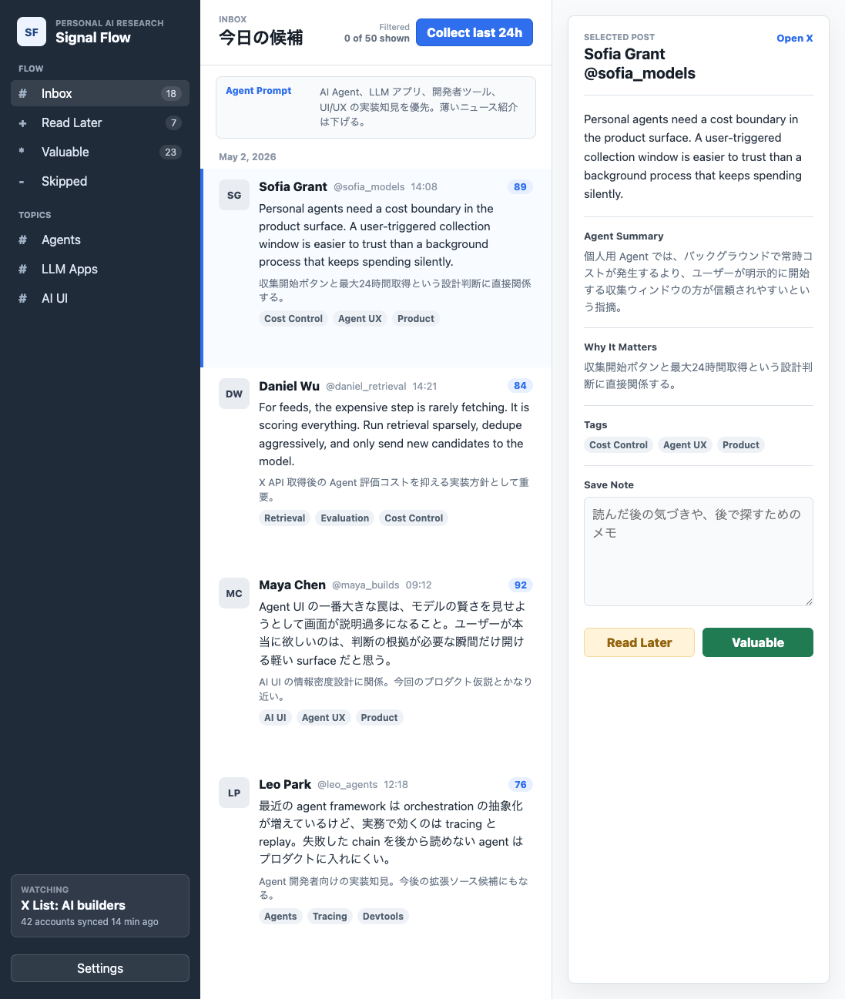

# Agent Walker

Agent Walker は、X の curated List から AI 関連の高シグナルな投稿を収集し、AI Agent が選別して表示する個人用リサーチ Inbox です。

現在の「X List をスクロールしながら気になる投稿を探す」体験を、明示的な収集、AI によるフィルタリング、軽量な 3 ペイン UI に置き換えることを目指しています。



## コンセプト

X の List をそのまま読むのではなく、ユーザーが `Collect last 24h` を押したタイミングで最大 200 件の投稿を収集し、AI Agent が最大 50 件まで絞り込んで Inbox に表示します。

ユーザーは投稿を以下に分類します。

- `Read Later`: 気になるが、まだ価値は未確定。
- `Valuable`: 読んだ結果、今後も参照したい投稿。
- `Skipped`: 不要。今後似た投稿の優先度を下げたい投稿。

この分類結果を次回以降の Agent 判断に使うことで、個人の関心に合った research inbox に育てていきます。

## MVP 方針

- 個人用ツールとして始める。
- 情報ソースはまず X に絞る。
- 常時巡回ではなく、ユーザー操作で収集する。
- 1 回の収集は最大 200 投稿。
- UI に表示するのは Agent が選んだ最大 50 投稿。
- UI は 3 ペイン構成にする。
  - 左: Inbox / Read Later / Valuable / Skipped / Topics
  - 中央: 本文中心の投稿フロー
  - 右: 投稿詳細、Agent summary、理由、タグ、メモ

## 現在の状態

このリポジトリには、静的 HTML/CSS/JS で作ったプロトタイプが入っています。

ローカルでは `index.html` をブラウザで開くと表示できます。

```text
index.html
styles.css
app.js
```

## ドキュメント

- [仕様](docs/spec.md)
- [設計](docs/design.md)
- [TODO](docs/TODO.md)

## 次の実装候補

今後は、この静的プロトタイプを参照しながら本実装へ移行します。

候補スタック:

- Next.js / React
- TypeScript
- SQLite
- Prisma または Drizzle
- OpenAI API
- X API v2

最初の本実装では、UI のコンポーネント化、永続化、X List posts fetcher、Agent scoring の順に進める想定です。
